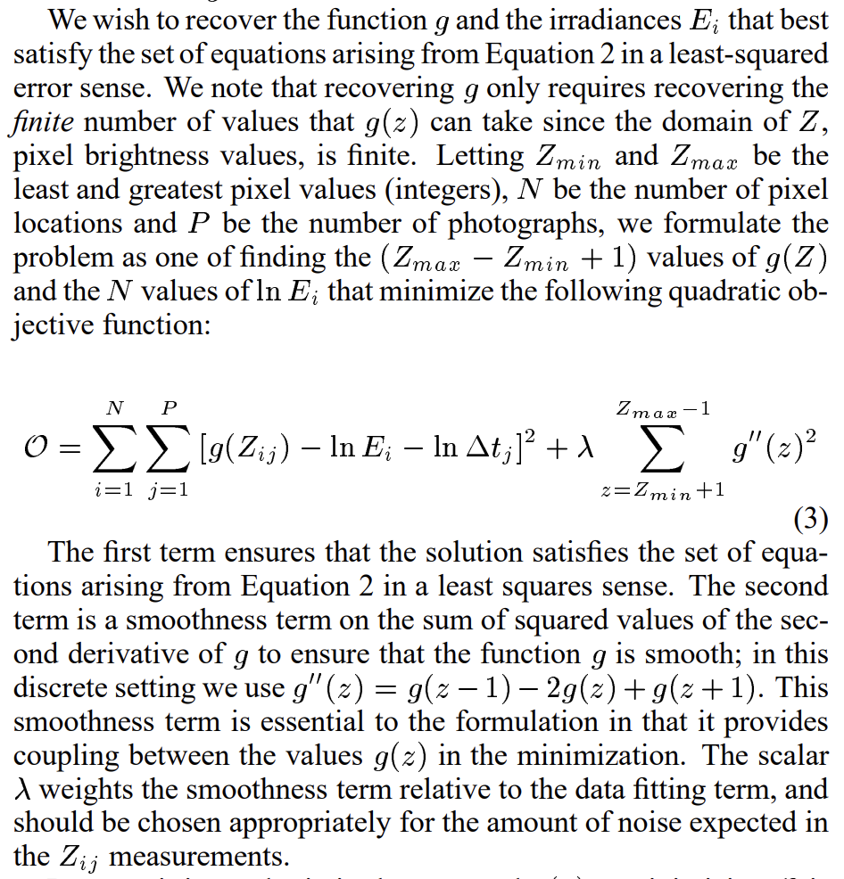

虽然作者在`gsolve.m`文件中填充A矩阵用了$N\times P + 254 + 1$，但是在[原论文](http://pages.cs.wisc.edu/~lizhang/courses/cs766-2008f/projects/hdr/debevec-siggraph97.pdf)中，作者解释了公式(3)，也说明了用$N\times P + 256 + 2$的原因，需要用欧拉公式$g^{\prime\prime}(z)=g(z-1)-2g(z)+g(z+1)$进行平滑。论文中的解释如下：

</img>

而`gsolve.m`文件中也实现了这个部分，$k$从$1$循环到$n-2$即$k\in[1,254]$:

    
</img>

